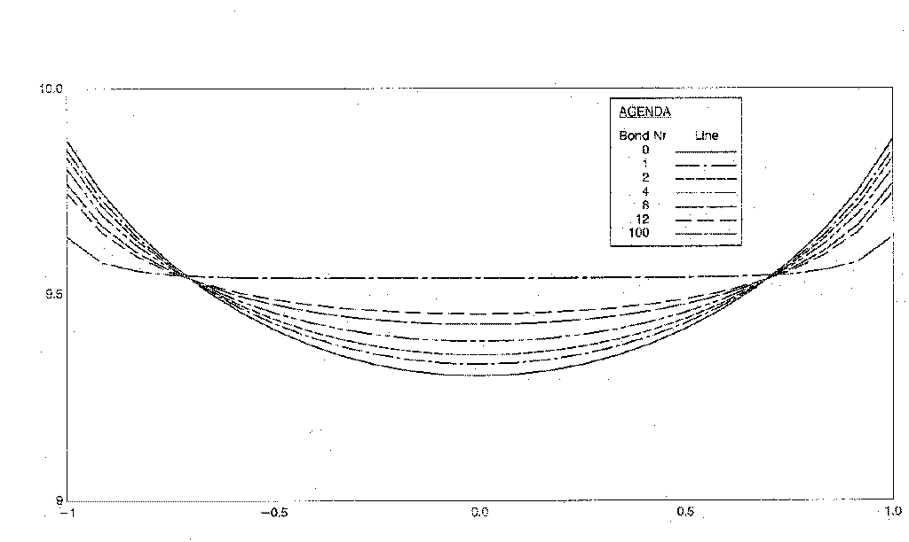
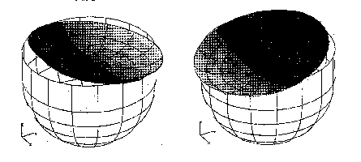
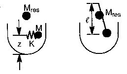

*The increasingly large volumes of fluid that have to be carried aboard satellites designed for long operating lifetimes, but which often must also deliver high-accuracy pointing, mean that special attention has to be paid to the behavior of fluids in low gravity.*

## Low gravity and fluid dynamics

There are several methods for analyzing the dynamic behavior of fluids under normal gravity conditions on Earth. A common assumption in such methods is that the free surface of the fluid is flat and at right angles to the direction in which gravity is acting, i.e. normal to the gravity vector. In this case, surface tension does not contribute to the fluid's dynamic behavior. However, this assumption is no longer valid if gravity is significantly reduced, as is the case for a satellite in orbit.

An indicator of the importance of the surface tension is the so-called 'Bond number', which is a measure of the relative magnitudes of the gravitational and capillary forces. It is proportional to the gravity level, the fluid density and the square of the characteristic length of the fluid's free surface, and is inversely proportional to the surface tension of the fluid. If the Bond number is much greater than 1, the surface- tension effects can be neglected and if it is much less than 1, the gravity forces can be neglected.

For example, the Bond number for water in a 2.7 mm- diameter tube subject to Earth's gravity is 1, and the fluid surface in such a tube is curved. If the tube diameter is much smaller, gravity forces have no significant influence on the fluid, and the water would not flow out when the tube is turned upside down.

The gravity level on an orbiting spacecraft is very low. Under such conditions, a fluid in a typical 1 m-diameter tank will have a Bond number of less than 1, which means that the free surface will be curved and surface tension has to be considered when modelling the fluid. In some cases, it might be possible to neglect gravity effects in the analysis, depending on the tank's diameter and the type of fluid that it holds. This would be true, for example, for a 0.6 m tank carrying nitrous oxide, for which the Bond number would be 0.1 under a ‘Eureca-type’ residual acceleration.

Tanks for microgravity applications often contain baffles and fluid-management devices and their effects need to be considered as a next step.

## Fluid sloshing frequencies

The fluid sloshing modes of tanks subject to Earth's gravity exhibit frequencies that are usually far below the structural resonance frequencies. The first sloshing mode in a typical spacecraft tank has a frequency around 1 Hz. The frequency is approximately proportional to the square root of the gravity, and therefore decreases if the gravity level is reduced. If the Bond number becomes small, the frequency's dependence on the surface-tension increases. Analytical solutions are possible for simple problems of limited engineering value, but numerical methods are needed to model complex engineering problems.

Fluid sloshing mode frequencies in microgravity are generally very low, typically in the range 0.1 to 0.01 Hz. These low- frequency modes could interfere with the structural bending modes of large solar arrays, or with the satellite's Attitude and Orbit Control System (AOCS). As a result, such fluid effects in low gravity need to be determined as one of the more critical inputs when analyzing the dynamic control of satellites.

## Analysis methods

Appropriate analysis capabilities require facilities for the generation of a simplified dynamic model (few degrees of freedom) of the propellant fluid in low gravity for coupling with satellite mass and stiffness matrices as input to the satellite AOCS model.

The analysis is conducted in three steps. As a first step, the shape of the fluid's free surface is determined. Subsequently, the mass and stiffness matrices are evaluated. Finally, the fluid modes and frequencies are computed and simplified models are derived, assuming a rigid tank. At present, the analysis of the tank geometry is limited to cylindrical tanks with elliptical end caps, a spherical tank being a special case of such a geometry.

## Free-surface shape determination

As mentioned earlier, the two shape extremes are the flat free surface obtained when the surface tension is negligible, and the spherical surface in zero gravity. Numerical analysis is necessary when gravity and surface tension are taken into account simultaneously, and in most cases a non-linear iteration process is required to derive the free-surface shape. The latter is discretized using finite elements, and this idealization is employed to describe the boundary of the fluid.

Following figure shows the different shapes of the free surface at different Bond numbers for fluid contained in a cylindrical tank. It is possible in the analysis to define an offset angle between the tank's axis and gravity vector. The surface shapes displayed in the right-hand figure are for an offset angle of 5 degrees.

Once the free surface and its contact line with the tank wall have been established, it is easy to determine the fluid boundary necessary to establish the fluid dynamics.

## Generation of fluid mass and stiffness matrices

To account for the effect of the fluid on the satellite, the fluid mass and stiffness matrices are generated and implemented in the satellite mathematical model. In general, the latter is built up using the finite-element method (FEM). Similar finite-element representation of the fluid would involve a significant mesh- generation effort. Boundary-element techniques, however, facilitate the generation of the fluid matrices. A number of difficulties related to the usage of the boundary-element method (BEM) for this type of fluid processing have been solved. The combination of FEM and BEM techniques arrived at has been employed successfully to represent satellite propellant tanks, which have then been coupled into the satellite mathematical model for pointing-performance
evaluations.

As an example of the analysis possibilities, following figure shows the first mode of vibration of the fluid in a satellite tank.

The first fluid sloshing mode at 0.02 Hz

## Derivation of dynamically equivalent simple models

The importance of each mode of vibration depends on the load generated at the tank interface with the satellite. The interface force depends on the effective modal mass matrix of the vibrational modes. It is possible to derive from the latter single-degree-of-freedom models which have equivalent dynamic behavior in terms of tank interface loads.

Mass-spring and pendulum models are two types of models which can be inserted directly into the satellite AOCS model

The mass-spring and pendulum models

The simplified mass-spring models are determined by the vibrating mass and its location, the spring stiffness, and the residual mass and its location. The vibration characteristics of the pendulum model are determined by the pendulum length rather than the spring stiffness, and can be used for non-zero-gravity conditions.
