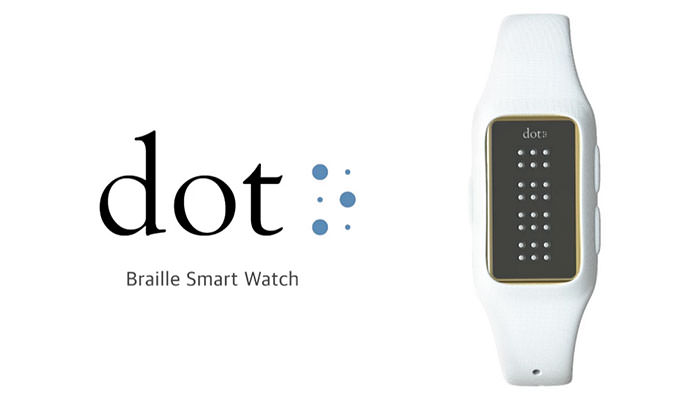
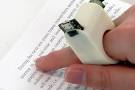
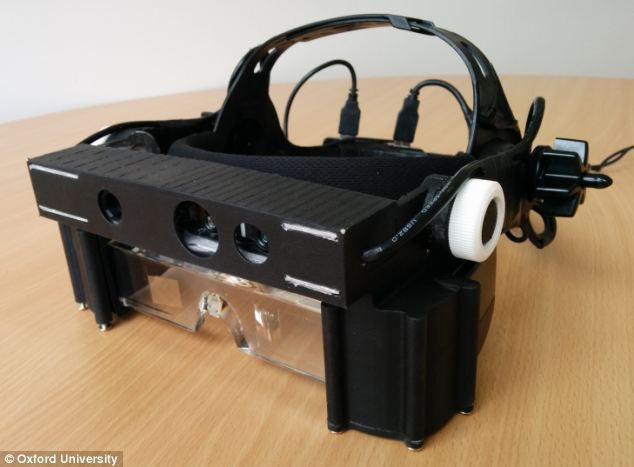
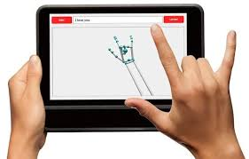
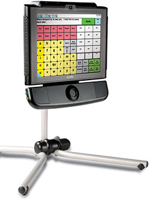
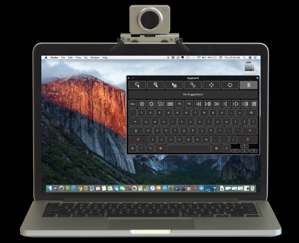
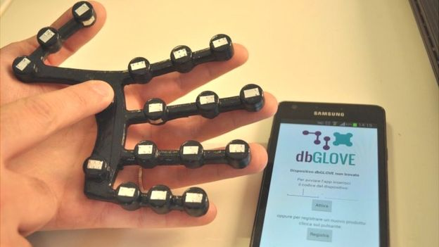

This year, the government of India dedicated the National Science Day to the theme “Science and Technology for specially-abled people”. The main aim was to encourage innovation and also to ease the difficulties of differently abled people. So here are 10 assistive technologies to assist them.

## Devices for people with visual Impairment

### DOT

It is the world’s first Braille smart watch which is affordable compared to the regular e-Braille devices. Technically this device consists of 6 dots on four cells on the screen of the watch which forms 4 letters in Braille at any time. This tool helps the visually impaired to get access to messages, tweets and books.

### FingerReader

FingerReader is an index-finger wearable device which assists the visually impaired in reading as well as translating texts. The small camera on the FingerReader scans the text and gives real-time audio feedback of the word it detects. 

### Smart Glasses:

A pair of glasses has been developed by the Oxford University to aid the people with limited vision which enables them to walk around unfamiliar places. The smart glasses consist of a video camera mounted on the frame of the glasses, a computer processing unit that is small enough to fit in a pocket and software that provides images of objects close-by to the see-through displays in the eyepieces of the glasses.  

## Devices for people with hearing Impairment

### UNI

It is a two way communication tool that relies upon gestures and speech technology. It works by detecting hand and finger gestures with its specialised camera and then converting into text to provide meaning to given sign language. It also has an additional feature of voice recognition software that will convert speech into text.

### Transcense

Transcense is a mobile app that accurately translates conversation in real time to text format. It works by catching conversations from the voices of different individuals and assigning them a colour bubble so the deaf person knows who said what. With the help of distributed microphone systems on each Smartphone the app catches the words of each individual and converts it into text.

## Devices for people with speech Impairment

### DynaVox EyeMax

This device gives the ability to participate in spoken communication using only eyes. The device consists of a sophisticated eye tracking system so that the users can interact with the on-screen keyboard to enter words and phrases which are then converted to spoken text using text-to-speech mechanism of the device.

### Talkitt

This application helps people by translating unintelligible pronunciation into understandable speech. It works by learning the user’s speech pattern first, creating a personal speech dictionary. Then it identifies and recognises the unintelligible pronunciations and translates it to speech which people can understand.

## Technologies for others

### HeadMouse Nano

HeadMouse Nano replaces the standard computer mouse for people with limited hand movements. The HeadMouse has a wireless optical sensor mounted on top of the monitor screen which tracks and translates the natural movements of user’s head into directly proportional mouse pointer movements.

### Bionics

Advances in 3D printing and bio-electronics are allowing replacement of lost limbs with prosthetics, giving specially-abled person an extra functionality. Though the technology with bionic is still in its initial stages but few bionic items already exist, the best known being the cochlear implant, a device for deaf people.

### dbGlove

This device helps the deaf blind people to communicate using tactical alphabets - pressing or pinching different parts of the hand represents different letters .The device consists of a sensor that converts these alphabet tracings into computer text and also trace the letters back onto the hand.  This will enable deaf blind people to operate computers and smart phones.
